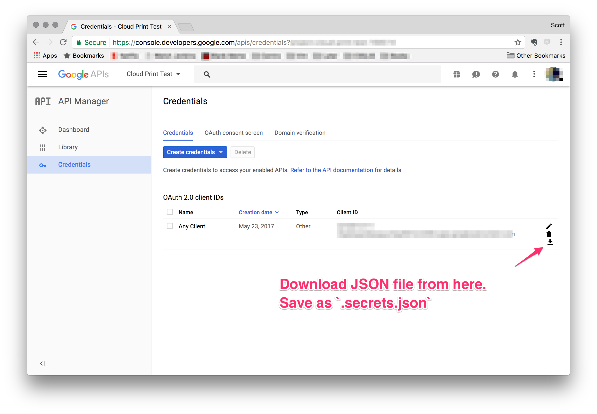

# Google Cloud Print Directory

Listen to a directory for new files and send files to Google Cloud Print.

## Usage

1. Pick a directory to watch for changes.
2. Create a config.yml file in the directory. Format specified below.
3. `gcp_listen PATH_TO_DIRECTORY`

### Setup OAUTH

1. Get secrets from from Google API Console website: https://console.developers.google.com
2. Copy client secrets file to `.secrets.json` in listening directory. 
3. run `gcp_fetch_token PATH_TO_DIRECTORY`

If you need to listen to multiple directories startup more than one program.

### config.json
```json
{
  "printerid": "some_printer_id",
  "ticket": {
    "version": "1.0",
    "print": {}
  }
}
```

## Installation

Add this line to your application's Gemfile:

```ruby
gem 'gcp_directory'
```

And then execute:

    $ bundle

Or install it yourself as:

    $ gem install gcp_directory

## Development

After checking out the repo, run `bin/setup` to install dependencies. Then, run `rake spec` to run the tests. You can also run `bin/console` for an interactive prompt that will allow you to experiment.

To install this gem onto your local machine, run `bundle exec rake install`. To release a new version, update the version number in `version.rb`, and then run `bundle exec rake release`, which will create a git tag for the version, push git commits and tags, and push the `.gem` file to [rubygems.org](https://rubygems.org).

## Contributing

Bug reports and pull requests are welcome on GitHub at https://github.com/ddrscott/gcp_directory.


## License

The gem is available as open source under the terms of the [MIT License](http://opensource.org/licenses/MIT).

